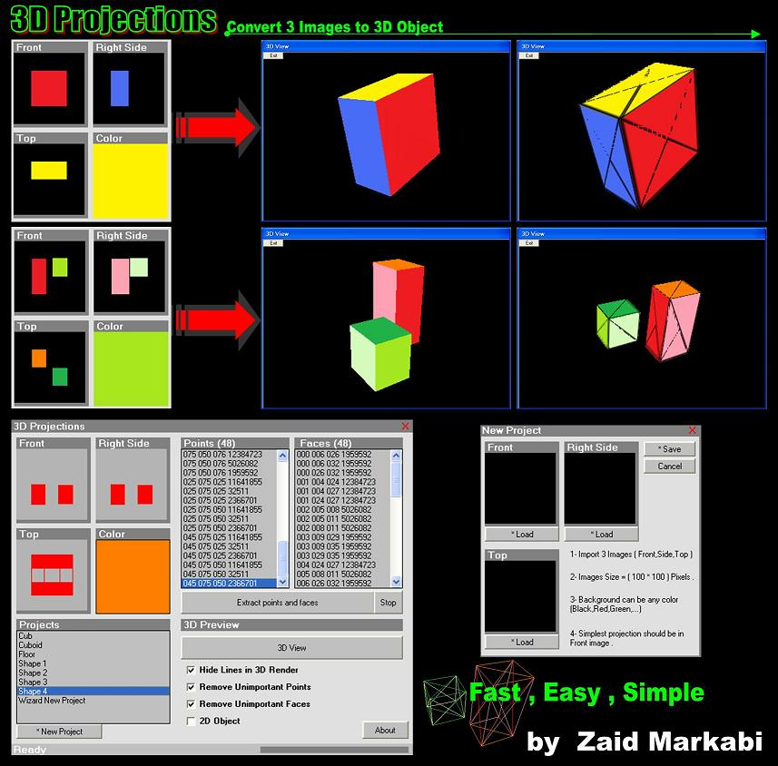



## Projections3D \- convert 3 images to 3d object

### Description

3D Projections

Convert 3 images to 3D object, (2d to 3d convertor) , this small program let you to create 3d objects..

if you have any comments, just tell me..

your comments help me to improve my hobby in programming..

Email : ZaidMarkabi@yahoo.com

Website: www.yazanmarkabi.webs.com
 
### More Info
 

             |
---                |---
**Submitted On**   |2009-05-29 18:39:04
**By**             |[Zaid Markabi](https://github.com/Planet-Source-Code/PSCIndex/blob/master/ByAuthor/zaid-markabi.md)
**Level**          |Advanced
**User Rating**    |4.8 (24 globes from 5 users)
**Compatibility**  |VB 5\.0, VB 6\.0
**Category**       |[DirectX](https://github.com/Planet-Source-Code/PSCIndex/blob/master/ByCategory/directx__1-44.md)
**World**          |[Visual Basic](https://github.com/Planet-Source-Code/PSCIndex/blob/master/ByWorld/visual-basic.md)
**Archive File**   |[Projection215408632009\.zip](https://github.com/Planet-Source-Code/zaid-markabi-projections3d-convert-3-images-to-3d-object__1-72147/archive/master.zip)

